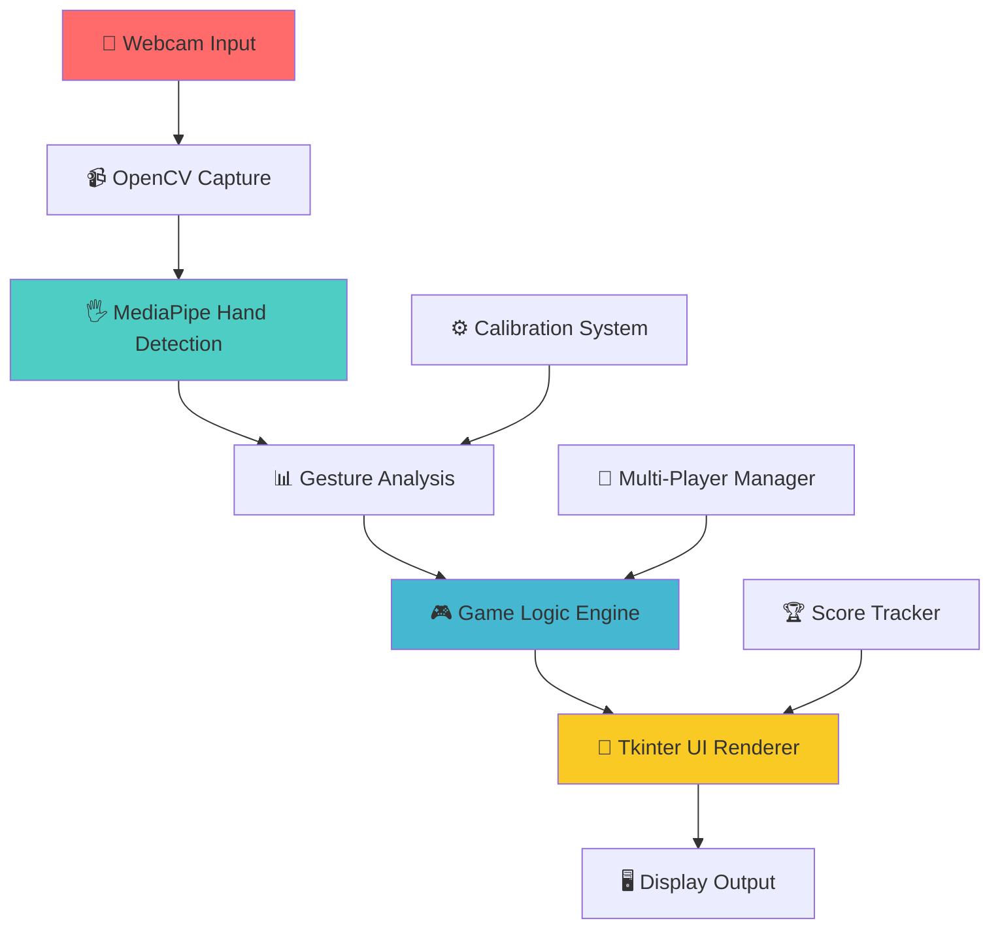

# 🐍 Snaky Baby - Enhanced Gesture-Controlled Snake Game 🎮

<div align="center">


<h3>🚀 Experience the classic Snake game like never before with cutting-edge hand gesture controls! 🚀</h3>

[](https://python.org)
[](https://opencv.org)
[](https://mediapipe.dev)
[](https://docs.python.org/3/library/tkinter.html)


</div>

---

## 🎯 **What Makes Snaky Baby Special?**

<div align="center">

```
     🎮 No Keyboard Needed    🖐️ Gesture Controls    🏆 Multiplayer Mode
          ↓                        ↓                       ↓
    ┌─────────────┐          ┌─────────────┐         ┌─────────────┐
    │    Just     │          │   Move Your │         │  Up to 4    │
    │   Use Your  │    ➜     │    Hand to  │   ➜     │   Players   │
    │   Webcam!   │          │  Control!   │         │   Compete!  │
    └─────────────┘          └─────────────┘         └─────────────┘
```

</div>

---

## ✨ **Features That Will Blow Your Mind**

<table>
<tr>
<td width="50%">

### 🎯 **Advanced Gesture Controls**
- 🖐️ **Open Palm**: Navigate your snake
- ✊ **Closed Fist**: Pause/Resume game
- 🔄 **Real-time calibration** for personalized controls
- 📐 **Adaptive hand size detection**

### 🎮 **Enhanced Multiplayer**
- 👥 **Up to 4 players** can compete
- 📊 **Dynamic score tracking**
- 🏆 **Championship results**
- 🔄 **Smooth turn transitions**

</td>
<td width="50%">

### 🎨 **Modern UI/UX**
- ✨ **Professional animated interface**
- 📱 **Scalable and responsive design**
- 🖥️ **Fullscreen mode support**
- 🎭 **Smooth visual transitions**

### ⚡ **Robust Performance**
- 🧵 **Multithreaded camera capture**
- 🎬 **Custom rendering pipeline**
- 📈 **Adaptive difficulty scaling**
- 🔧 **Optimized frame rates**

</td>
</tr>
</table>

---

## 🛠️ **Tech Stack & Architecture**

<div align="center">

### **Core Technologies**

| Technology | Version | Purpose | Badge |
|------------|---------|---------|--------|
| **Python** | 3.6+ | Core Language |  |
| **OpenCV** | 4.0+ | Computer Vision |  |
| **MediaPipe** | 0.8+ | Hand Tracking |  |
| **Tkinter** | Built-in | GUI Framework |  |
| **NumPy** | Latest | Numerical Computing |  |

### **Architecture Flow**

</div>



---

## 🚀 **Quick Start Guide**

<div align="center">

### **Step 1: Clone the Repository**

</div>

```bash
# 📥 Clone the amazing Snaky Baby repository
git clone https://github.com/abhinav29102005/snaky_baby.git

# 📂 Navigate to the project directory
cd snaky_baby
```

<div align="center">

### **Step 2: Install Dependencies**

</div>

```bash
# 🔧 Install all required packages with one command!
pip install opencv-python mediapipe numpy tkinter

# Or use requirements.txt if available
pip install -r requirements.txt
```

<div align="center">

### **Step 3: Launch the Game**

</div>

```bash
# 🎮 Start your gesture-controlled adventure!
python main.py
```

---

## 🎮 **How to Play Like a Pro**

<div align="center">

### **Game Flow Visualization**

</div>

```
🏠 Main Menu → 👥 Select Players → ✏️ Enter Names → 🤏 Calibration → 🎮 Game Start
     ↓              ↓                ↓              ↓              ↓
   Press 1-4    Enter player      Move hand      Open palm =    🐍 Control
   to choose      names for      slowly for       Navigate       your snake!
   players      multiplayer     calibration        game           
```

### **🖐️ Gesture Commands**

<table align="center">
<tr>
<th width="30%">Gesture</th>
<th width="35%">Action</th>
<th width="35%">Visual Cue</th>
</tr>
<tr>
<td align="center">🖐️ <strong>Open Palm</strong></td>
<td align="center">Move Snake Direction</td>
<td align="center">✅ Green indicator</td>
</tr>
<tr>
<td align="center">✊ <strong>Closed Fist</strong></td>
<td align="center">Pause/Resume Game</td>
<td align="center">⏸️ Pause icon</td>
</tr>
<tr>
<td align="center">👋 <strong>No Hand</strong></td>
<td align="center">Continue Current Direction</td>
<td align="center">➡️ Arrow indicator</td>
</tr>
</table>

### **⌨️ Keyboard Shortcuts**

| Key | Function | Description |
|-----|----------|-------------|
| `Q` | Quit Game | 🚪 Exit the application |
| `F` | Fullscreen | 🖥️ Toggle fullscreen mode |
| `ENTER` | Confirm | ✅ Advance to next screen |
| `BACKSPACE` | Delete | ❌ Remove character in name input |
| `ESC` | Back | ⬅️ Return to main menu |
| `1-4` | Players | 👥 Select number of players |

---

## 📋 **System Requirements**

<div align="center">

### **Minimum Requirements**

</div>

| Component | Requirement | Recommended |
|-----------|-------------|-------------|
| **🖥️ OS** | Windows 7+, macOS 10.12+, Ubuntu 16.04+ | Windows 10+, macOS 12+, Ubuntu 20.04+ |
| **🐍 Python** | 3.6+ | 3.8+ |
| **📹 Webcam** | Any USB/Built-in webcam | HD webcam (720p+) |
| **💾 RAM** | 4GB | 8GB+ |
| **💽 Storage** | 500MB free space | 1GB free space |
| **🌐 Internet** | Required for installation | Stable connection |

---

## 🏆 **Game Modes & Features**

<div align="center">

### **🎯 Single Player Mode**
Perfect your gesture control skills and achieve high scores!

### **👥 Multiplayer Mode (2-4 Players)**
Compete with friends in turn-based gameplay with comprehensive scoring!

### **🔧 Calibration System**
Personalized hand tracking for optimal control precision!

</div>

---

## 🤝 **Contributing**

We welcome contributions from the community! Here's how you can help make Snaky Baby even better:

<div align="center">

### **Ways to Contribute**

</div>

| Contribution Type | How to Help | Badge |
|-------------------|-------------|--------|
| 🐛 **Bug Reports** | Found a bug? Open an issue! |  |
| ✨ **Feature Requests** | Have an idea? We'd love to hear it! |  |
| 💻 **Code Contributions** | Submit a pull request! |  |
| 📚 **Documentation** | Help improve our docs! |  |

### **Development Setup**

```bash
# 🔧 Set up development environment
git clone https://github.com/abhinav29102005/snaky_baby.git
cd snaky_baby

# 🐍 Create virtual environment (recommended)
python -m venv venv
source venv/bin/activate  # Linux/Mac
# or
venv\Scripts\activate     # Windows

# 📦 Install dependencies
pip install -r requirements.txt
```

---

## 🐛 **Troubleshooting**

<details>
<summary><strong>🔍 Common Issues & Solutions</strong></summary>

### **Camera Not Detected**
- ✅ Ensure webcam is connected and not used by other apps
- ✅ Try different USB ports
- ✅ Check camera permissions in system settings

### **Poor Hand Detection**
- ✅ Ensure good lighting conditions
- ✅ Keep hand clearly visible in camera frame
- ✅ Complete the calibration process properly

### **Performance Issues**
- ✅ Close other camera-using applications
- ✅ Lower camera resolution if possible
- ✅ Check system resources (CPU/RAM usage)

### **Installation Problems**
```bash
# If pip install fails, try:
pip install --upgrade pip
pip install --user opencv-python mediapipe numpy

# For macOS users:
brew install python-tk
```

</details>

---

## 🎖️ **Achievements & Stats**

<div align="center">


### **🏆 Project Milestones**

- ✅ **Gesture Recognition** - Advanced hand tracking implementation
- ✅ **Multiplayer Support** - Up to 4 players competitive mode
- ✅ **Real-time Calibration** - Personalized control system
- ✅ **Modern UI** - Professional animated interface
- 🎯 **Future**: AI opponent mode, online multiplayer, custom themes

</div>

---

## 📞 **Get in Touch**

<div align="center">

### **Connect with the Developer**

[](https://linkedin.com/in/bigboyaks)
[](mailto:asingh3_be24@thapar.edu)
[](https://github.com/abhinav29102005)

### **💝 Show Your Support**

If you enjoyed this project, please consider:

[](https://github.com/abhinav29102005/snaky_baby)
[](https://github.com/abhinav29102005/snaky_baby/fork)
[](https://github.com/abhinav29102005)

</div>

---

## 📜 **License**

<div align="center">

This project is licensed under the **MIT License** - see the [LICENSE](LICENSE) file for details.


</div>

---

<div align="center">

### **🎉 Thank you for checking out Snaky Baby! 🎉**

**Made with ❤️ and lots of ☕ by [Abhinav Singh](https://github.com/abhinav29102005)**

---

*🐍 Ready to play? Let's get those gestures moving! 🚀*

[](#-snaky-baby---enhanced-gesture-controlled-snake-game-)

</div>
